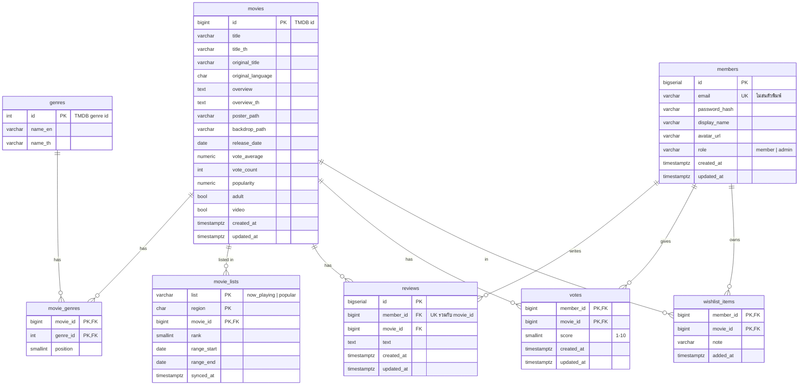

# MovieHub Database Schema (ส่งให้ทีม Go)

| ไฟล์ | ใช้ทำอะไร |
|---|---|
| [`docs/db/schema.sql`](db/schema.sql) | สร้างตาราง (PostgreSQL 14+) ทั้งข้อมูลหนังจาก TMDB และข้อมูลของเว็บเรา (สมาชิก รีวิว คะแนน wishlist) พร้อม seed แนวหนัง 19 แนว รันครั้งเดียว |
| [`docs/db/seed.sql`](db/seed.sql) | ข้อมูลตั้งต้น 100 เรื่อง: กำลังฉายในไทย 48 เรื่อง + ยอดนิยมที่ไม่ซ้ำ 52 เรื่อง (ดึงเมื่อ 2026-09-30) รันซ้ำได้ |
| [`docs/db/make-seed.mjs`](db/make-seed.mjs) | สร้าง seed.sql ใหม่จาก TMDB: `node --env-file=.env docs/db/make-seed.mjs` |

```bash
psql "$DATABASE_URL" -f docs/db/schema.sql
psql "$DATABASE_URL" -f docs/db/seed.sql
```

## 1. ที่มาของข้อมูล: หนัง Now Playing + Popular

หน้าเว็บ TMDB ใช้ URL นี้แสดงหน้าปฏิทิน "กำลังฉาย"

```
https://www.themoviedb.org/discover/movie/calendar.json?preset=now-playing&vote_average.gte=0&vote_average.lte=10
```

URL นี้เป็น endpoint ภายในของเว็บ ไม่ใช่ API ทางการ ไม่ต้องใช้ key ก็จริง แต่ **ไม่มีเอกสาร รูปแบบเปลี่ยนได้ทุกเมื่อ และเลือกประเทศตาม IP ของเครื่องที่เรียก** (server ที่อยู่ต่างประเทศจะไม่ได้รายการของไทย)
ฝั่ง backend จึงควรดึงจาก API ทางการ (ใช้ API key ตัวเดียวกับ `.env` ของหน้าเว็บ) ซึ่งให้ข้อมูลชุดเดียวกัน

| วิธี | Endpoint | หมายเหตุ |
|---|---|---|
| แนะนำ | `GET /3/movie/now_playing?region=TH&language=th-TH&page=1..N` | วิธีเดียวกับ `getNowPlaying()` ใน [src/api/tmdb.js](../src/api/tmdb.js) ได้ `dates.minimum/maximum` มาเป็นช่วงวันด้วย |
| เท่ากับ preset ของเว็บ | `GET /3/discover/movie?region=TH&with_release_type=2\|3&release_date.gte={วันนี้-35}&release_date.lte={วันนี้+7}&sort_by=popularity.desc` | ช่วงวันเดียวกับ `range_start`/`range_end` ของ calendar.json |

TMDB ให้หน้าละ 20 เรื่อง วนดึงจนครบ `total_pages` แล้วตัดเรื่องซ้ำด้วย `id`

### เติมด้วยหนังยอดนิยมให้ครบ 100 เรื่อง

หนังกำลังฉายในไทยมีแค่ราว 40–60 เรื่อง จึงเติมด้วย `GET /3/movie/popular?region=TH&page=1..N` (JSON รูปร่างเดียวกับ now_playing แต่ไม่มี `dates`)
ไล่ทีละหน้า **ข้ามเรื่องที่อยู่ใน now playing แล้ว** จนรวมกันได้ 100 เรื่อง กติกาเดียวกับ `getNowPlayingAndPopular()` ใน [src/api/tmdb.js](../src/api/tmdb.js)

### ตัวอย่างข้อมูลจริง (calendar.json วันที่ 2026-09-30)

```json
{
  "media_type": "movie",
  "total_results": 35,
  "range_start": "2026-08-26",
  "range_end": "2026-10-07",
  "items_by_date": {
    "2026-09-17": [
      {
        "id": 1423191,
        "name": "Resident Evil",
        "original_name": "Resident Evil",
        "original_language": "en",
        "overview": "Medical courier Bryan unwittingly finds himself...",
        "genre_ids": [27, 878, 12],
        "poster_path": "/i7UyjfPio0VFHB9rBUZSFyhOoM8.jpg",
        "backdrop_path": "/3icyRAqgakNcQn6aDVz9libFmBA.jpg",
        "release_date": "2026-09-17",
        "vote_average": 7.337,
        "vote_count": 609,
        "popularity": 366.0537,
        "adult": false,
        "video": false,
        "softcore": false,
        "media_id": "67942023feac9b712623a8f0",
        "media_type": "movie",
        "url": "/movie/1423191-resident-evil"
      }
    ]
  }
}
```

## 2. ภาพรวมตาราง



| ตาราง | เก็บอะไร | ทำไมแยก |
|---|---|---|
| `movies` | ข้อมูลหนัง 1 แถวต่อเรื่อง | |
| `genres` | แนวหนัง 19 แนวของ TMDB ชื่อไทย/อังกฤษ | รายการหนังให้มาแค่รหัส (`genre_ids`) |
| `movie_genres` | หนังเรื่องไหนอยู่แนวไหน | 1 เรื่องมีหลายแนว (many-to-many) |
| `movie_lists` | เรื่องไหนอยู่ในรายการไหน (`now_playing` / `popular`) ของประเทศไหน ลำดับที่เท่าไร | รายการเปลี่ยนทุกสัปดาห์ แต่หนังและรีวิวต้องอยู่ต่อ และเพิ่มรายการใหม่ได้โดยไม่ต้องสร้างตาราง |
| `members` | สมาชิกของเว็บ อีเมลห้ามซ้ำ (ไม่สนตัวพิมพ์เล็กใหญ่) เก็บรหัสผ่านเป็น bcrypt hash | |
| `reviews` | รีวิวจาก ReviewForm สมาชิก 1 คนรีวิวหนัง 1 เรื่องได้ 1 ครั้ง (แก้ได้) | |
| `votes` | คะแนน 1–10 ที่สมาชิกให้หนัง 1 คน 1 เรื่อง 1 คะแนน | แยกจากรีวิว เพราะให้คะแนนได้โดยไม่ต้องเขียนรีวิว |
| `wishlist_items` | หนังที่สมาชิกแต่ละคนอยากดู (1 คน 1 wishlist) | |
| `movie_vote_stats` (view) | คะแนนเฉลี่ยและจำนวนโหวตจากสมาชิกเว็บเราต่อเรื่อง | คำนวณสดจาก `votes` ไม่ต้องเก็บซ้ำ แยกจาก `movies.vote_average` ที่เป็นคะแนนของ TMDB |

ลบสมาชิก 1 คน รีวิว คะแนน และ wishlist ของคนนั้นจะถูกลบตามไปด้วย (`ON DELETE CASCADE`)

## 3. Mapping: JSON ของ TMDB → คอลัมน์

| JSON (calendar.json) | JSON (API ทางการ) | คอลัมน์ | หมายเหตุ |
|---|---|---|---|
| `id` | `id` | `movies.id` | ใช้เลข TMDB เป็น PK เลย (ตอบคำถามใน api-wishlist.md ว่าใช้ id ของ TMDB) |
| `name` | `title` | `movies.title` | calendar.json ใช้ชื่อ field แบบทีวี (`name`) |
| – | `title` (ตอน `language=th-TH`) | `movies.title_th` | ต้องเรียกแยกอีกรอบด้วยภาษาไทย ถ้าไม่มีชื่อไทย TMDB จะคืนชื่ออังกฤษมา ให้เก็บ NULL แทน |
| `original_name` | `original_title` | `movies.original_title` | |
| `original_language` | `original_language` | `movies.original_language` | |
| `overview` | `overview` | `movies.overview` / `overview_th` | อาจเป็น `""` ให้เก็บ NULL |
| `poster_path` | `poster_path` | `movies.poster_path` | เก็บแค่ path อาจเป็น null |
| `backdrop_path` | `backdrop_path` | `movies.backdrop_path` | อาจเป็น null |
| `release_date` | `release_date` | `movies.release_date` | อาจเป็น `""` ให้เก็บ NULL |
| `vote_average` | `vote_average` | `movies.vote_average` | 0–10 ทศนิยม 3 ตำแหน่ง ปัดเหลือ 1 ตำแหน่งตอนตอบ API |
| `vote_count` | `vote_count` | `movies.vote_count` | |
| `popularity` | `popularity` | `movies.popularity` | ใช้เรียงลำดับ |
| `adult`, `video` | `adult`, `video` | `movies.adult`, `movies.video` | |
| `genre_ids[i]` | `genre_ids[i]` | `movie_genres(genre_id, position=i)` | |
| ลำดับในรายการ (เริ่ม 1) | ลำดับในรายการ (เริ่ม 1) | `movie_lists.rank` | |
| `range_start` / `range_end` | `dates.minimum` / `dates.maximum` | `movie_lists.range_start` / `range_end` | มีเฉพาะ now_playing ส่วน popular เป็น NULL |
| key ของ `items_by_date` | – | ไม่เก็บ | ซ้ำกับ `movies.release_date` |
| `softcore`, `media_id`, `media_type`, `url` | – | ไม่เก็บ | เป็นค่าภายในของเว็บ TMDB / สร้างใหม่ได้จาก id |

## 4. Go structs

```go
type Movie struct {
    ID               int64      `db:"id"`
    Title            string     `db:"title"`
    TitleTh          *string    `db:"title_th"`
    OriginalTitle    string     `db:"original_title"`
    OriginalLanguage string     `db:"original_language"`
    Overview         *string    `db:"overview"`
    OverviewTh       *string    `db:"overview_th"`
    PosterPath       *string    `db:"poster_path"`
    BackdropPath     *string    `db:"backdrop_path"`
    ReleaseDate      *time.Time `db:"release_date"`
    VoteAverage      float64    `db:"vote_average"`
    VoteCount        int        `db:"vote_count"`
    Popularity       float64    `db:"popularity"`
    Adult            bool       `db:"adult"`
    Video            bool       `db:"video"`
    CreatedAt        time.Time  `db:"created_at"`
    UpdatedAt        time.Time  `db:"updated_at"`
}

type Genre struct {
    ID     int     `db:"id"`
    NameEn string  `db:"name_en"`
    NameTh *string `db:"name_th"`
}

type MovieGenre struct {
    MovieID  int64 `db:"movie_id"`
    GenreID  int   `db:"genre_id"`
    Position int16 `db:"position"`
}

type MovieList struct {
    List       string     `db:"list"`        // "now_playing" | "popular"
    Region     string     `db:"region"`
    MovieID    int64      `db:"movie_id"`
    Rank       int16      `db:"rank"`
    RangeStart *time.Time `db:"range_start"` // NULL สำหรับ popular
    RangeEnd   *time.Time `db:"range_end"`
    SyncedAt   time.Time  `db:"synced_at"`
}

type Member struct {
    ID           int64     `db:"id"            json:"id"`
    Email        string    `db:"email"         json:"email"`
    PasswordHash string    `db:"password_hash" json:"-"`          // ห้ามส่งออกไปหน้าเว็บ
    DisplayName  string    `db:"display_name"  json:"displayName"`
    AvatarURL    *string   `db:"avatar_url"    json:"avatarUrl"`
    Role         string    `db:"role"          json:"role"`       // "member" | "admin"
    CreatedAt    time.Time `db:"created_at"    json:"createdAt"`
    UpdatedAt    time.Time `db:"updated_at"    json:"-"`
}

type Review struct {
    ID        int64     `db:"id"         json:"id"`
    MemberID  int64     `db:"member_id"  json:"memberId"`
    MovieID   int64     `db:"movie_id"   json:"movieId"`
    Text      string    `db:"text"       json:"text"`
    CreatedAt time.Time `db:"created_at" json:"createdAt"`
    UpdatedAt time.Time `db:"updated_at" json:"updatedAt"`
}

type Vote struct {
    MemberID  int64     `db:"member_id"  json:"-"`
    MovieID   int64     `db:"movie_id"   json:"movieId"`
    Score     int16     `db:"score"      json:"score"`   // 1-10
    CreatedAt time.Time `db:"created_at" json:"-"`
    UpdatedAt time.Time `db:"updated_at" json:"updatedAt"`
}

type WishlistItem struct {
    MemberID int64     `db:"member_id" json:"-"`
    MovieID  int64     `db:"movie_id"  json:"movieId"`
    Note     *string   `db:"note"      json:"note"`
    AddedAt  time.Time `db:"added_at"  json:"addedAt"`
}
```

คอลัมน์ที่เป็น NULL ได้ใช้ pointer (หรือ `sql.NullString` / `pgtype` ตาม driver ที่ทีมเลือก)

## 5. ขั้นตอน sync (แนะนำวันละครั้ง เหมือน `onceADay` ของหน้าเว็บ)

ทำทั้งหมดใน **transaction เดียว** ต่อ 1 region

1. ดึงรายการ now playing ทุกหน้า แล้วดึง popular ทีละหน้า ข้ามเรื่องที่อยู่ใน now playing จนรวมได้ 100 เรื่อง (`language=en-US`)
   แล้วขอ `/3/movie/{id}?language=th-TH` ทีละเรื่องเพื่อเอา `title_th` / `overview_th`
2. `movies`: upsert ทีละเรื่อง
   ```sql
   INSERT INTO movies (id, title, title_th, original_title, ...)
   VALUES ($1, $2, $3, $4, ...)
   ON CONFLICT (id) DO UPDATE
      SET title = EXCLUDED.title, vote_average = EXCLUDED.vote_average, ..., updated_at = now();
   ```
3. `movie_genres`: `DELETE FROM movie_genres WHERE movie_id = $1` แล้ว insert `genre_ids` ใหม่พร้อม `position`
   (ถ้าเจอ genre id ที่ไม่มีในตาราง `genres` ให้ดึง `/3/genre/movie/list` มา upsert ก่อน)
4. `movie_lists`: `DELETE FROM movie_lists WHERE region = 'TH'` แล้ว insert ทั้ง 2 รายการใหม่พร้อม `rank`
5. COMMIT

[make-seed.mjs](db/make-seed.mjs) ทำตามขั้นตอนนี้ทุกข้อ ใช้เป็นตัวอย่างเขียน job ฝั่ง Go ได้

หนังที่หลุดจากทั้ง 2 รายการยังอยู่ใน `movies` (และรีวิวยังอยู่) แค่หายจาก `movie_lists`

## 6. Query ที่ endpoint ใน api-wishlist.md ใช้

ชื่อ field ที่ตอบกลับต้องเป็น camelCase รูปร่างเดียวกับ `toMovie()` ใน [src/api/tmdb.js](../src/api/tmdb.js)

| คอลัมน์ | field ใน JSON ที่ตอบหน้าเว็บ |
|---|---|
| `id` | `id`, `tmdbId` |
| `title` | `title` |
| `title_th` | `titleTh` |
| `genres.name_en` ของ `position = 0` | `genre` |
| `EXTRACT(YEAR FROM release_date)` | `year` |
| `round(vote_average, 1)` (ถ้าเป็น 0 ตอบ `null`) | `rating` |
| `COALESCE(overview_th, overview)` | `detail` |
| `'https://image.tmdb.org/t/p/w342' \|\| poster_path` | `poster` |

**GET /api/movies** (100 เรื่อง: กำลังฉายขึ้นก่อน ตามด้วยยอดนิยม ลำดับเดียวกับ `getMovies()` ของหน้าเว็บ)

```sql
SELECT m.id, m.title, m.title_th, g.name_en AS genre,
       EXTRACT(YEAR FROM m.release_date)::int AS year,
       round(m.vote_average, 1) AS rating,
       COALESCE(m.overview_th, m.overview) AS detail,
       m.poster_path, ml.list
FROM movie_lists ml
JOIN movies m             ON m.id = ml.movie_id
LEFT JOIN movie_genres mg ON mg.movie_id = m.id AND mg.position = 0
LEFT JOIN genres g        ON g.id = mg.genre_id
WHERE ml.region = 'TH'
ORDER BY ml.list = 'popular', ml.rank;   -- false มาก่อน true: now_playing ก่อน popular
```

ถ้าอยากให้หน้าเว็บขอแยกรายการได้ เพิ่ม `GET /api/movies?list=now_playing` หรือ `?list=popular` แล้วใส่เงื่อนไข `AND ml.list = $1`

**GET /api/movies?q=คำค้น**: เงื่อนไขเพิ่ม `AND (m.title ILIKE '%' || $1 || '%' OR m.title_th ILIKE '%' || $1 || '%')`

**GET /api/movies/{id}**: query เดียวกันแต่ `FROM movies m ... WHERE m.id = $1` (ไม่ต้อง join `movie_lists` เพราะหนังที่เลิกฉายแล้วก็ยังเปิดได้)

ถ้าต้องการแสดงคะแนนจากสมาชิกเว็บเราคู่กับคะแนน TMDB ให้ `LEFT JOIN movie_vote_stats vs ON vs.movie_id = m.id` แล้วตอบเพิ่มเป็น `memberRating` (`vs.vote_average`) และ `memberVoteCount` (`COALESCE(vs.vote_count, 0)`)

## 7. Query ของสมาชิก รีวิว คะแนน และ Wishlist

endpoint ที่มีคำว่า 🔒 ต้อง login ก่อน Go อ่าน `member_id` จาก session/token เอง **ห้ามรับ member_id จาก body หรือ URL** ไม่งั้นคนอื่นจะแก้ข้อมูลแทนกันได้

### สมาชิก

**POST /api/auth/register** body `{ "email", "password", "displayName" }`

```sql
INSERT INTO members (email, password_hash, display_name)
VALUES (lower($1), $2, $3)                -- $2 = bcrypt.GenerateFromPassword(password)
RETURNING id, email, display_name, role, created_at;
```

อีเมลซ้ำจะติด unique index `uq_members_email` (error code `23505`) ให้ตอบ 409 `{ "error": "อีเมลนี้ถูกใช้แล้ว" }`

**POST /api/auth/login**: `SELECT id, password_hash FROM members WHERE lower(email) = lower($1)` แล้วเทียบด้วย `bcrypt.CompareHashAndPassword` ผิดให้ตอบ 401 ข้อความเดียวกันทั้งกรณีไม่มีอีเมลและรหัสผิด

**GET /api/me** 🔒: `SELECT id, email, display_name, avatar_url, role, created_at FROM members WHERE id = $member`

### รีวิว

**GET /api/movies/{id}/reviews**

```sql
SELECT r.id, r.text, r.created_at, r.updated_at,
       mb.id AS member_id, mb.display_name, mb.avatar_url,
       v.score                                    -- คะแนนที่คนเขียนให้เรื่องนี้ (ถ้ามี)
FROM reviews r
JOIN members mb    ON mb.id = r.member_id
LEFT JOIN votes v  ON v.member_id = r.member_id AND v.movie_id = r.movie_id
WHERE r.movie_id = $1
ORDER BY r.created_at DESC
LIMIT 20 OFFSET $2;
```

**POST /api/movies/{id}/reviews** 🔒 body `{ "text" }`

```sql
INSERT INTO reviews (member_id, movie_id, text) VALUES ($member, $1, $2)
RETURNING id, text, created_at;
```

- text สั้นกว่า 10 ตัว ให้ Go ตอบ 400 `{ "error": "รีวิวสั้นเกินไป" }` เองก่อนถึง DB (CHECK ในตารางเป็นแค่ด่านสุดท้าย)
- `movie_id` ไม่มีในตาราง จะติด foreign key (`23503`) ให้ตอบ 404
- เคยรีวิวเรื่องนี้แล้ว จะติด unique (`23505`) ให้ตอบ 409 แล้วให้หน้าเว็บเปลี่ยนไปใช้ PUT

**PUT /api/reviews/{reviewId}** 🔒 / **DELETE /api/reviews/{reviewId}** 🔒

```sql
UPDATE reviews SET text = $2, updated_at = now() WHERE id = $1 AND member_id = $member;
DELETE FROM reviews WHERE id = $1 AND member_id = $member;
```

ถ้าได้ 0 แถว แปลว่าไม่มีรีวิวนี้หรือไม่ใช่ของคนนี้ ตอบ 404 (admin ลบได้ทุกรีวิวโดยตัดเงื่อนไข `member_id` ออก)

### คะแนน

**PUT /api/movies/{id}/vote** 🔒 body `{ "score": 8 }` (โหวตครั้งแรกหรือเปลี่ยนคะแนนใช้ endpoint เดียวกัน)

```sql
INSERT INTO votes (member_id, movie_id, score) VALUES ($member, $1, $2)
ON CONFLICT (member_id, movie_id) DO UPDATE SET score = EXCLUDED.score, updated_at = now();
```

score ต้องเป็นจำนวนเต็ม 1–10 ตรวจใน Go ก่อน ไม่ผ่านตอบ 400

**DELETE /api/movies/{id}/vote** 🔒: `DELETE FROM votes WHERE member_id = $member AND movie_id = $1`

**GET /api/movies/{id}** ตอนที่ login อยู่ เพิ่ม `myVote` และ `inWishlist` ได้ด้วย

```sql
SELECT (SELECT score FROM votes          WHERE member_id = $member AND movie_id = $1) AS my_vote,
       EXISTS (SELECT 1 FROM wishlist_items WHERE member_id = $member AND movie_id = $1) AS in_wishlist;
```

### Wishlist

**GET /api/me/wishlist** 🔒

```sql
SELECT m.id, m.title, m.title_th, g.name_en AS genre,
       EXTRACT(YEAR FROM m.release_date)::int AS year,
       round(m.vote_average, 1) AS rating, m.poster_path,
       w.note, w.added_at
FROM wishlist_items w
JOIN movies m             ON m.id = w.movie_id
LEFT JOIN movie_genres mg ON mg.movie_id = m.id AND mg.position = 0
LEFT JOIN genres g        ON g.id = mg.genre_id
WHERE w.member_id = $member
ORDER BY w.added_at DESC;
```

ตอบเป็นรายการหนังรูปร่างเดียวกับ `GET /api/movies` บวก `note` และ `addedAt` หน้าเว็บจะใช้ MovieCard เดิมได้เลย

**PUT /api/me/wishlist/{movieId}** 🔒 body `{ "note": "ดูกับแฟน" }` (ไม่ส่ง body ก็ได้)

```sql
INSERT INTO wishlist_items (member_id, movie_id, note) VALUES ($member, $1, $2)
ON CONFLICT (member_id, movie_id) DO UPDATE SET note = EXCLUDED.note;
```

ใช้ PUT เพราะกดซ้ำกี่ครั้งผลก็เหมือนเดิม หน้าเว็บไม่ต้องเช็กก่อนว่าเคยเพิ่มแล้วหรือยัง

**DELETE /api/me/wishlist/{movieId}** 🔒: `DELETE FROM wishlist_items WHERE member_id = $member AND movie_id = $1`

## 8. เรื่องที่ต้องตกลงกัน

- **DB**: ไฟล์นี้เขียนสำหรับ PostgreSQL ถ้าทีมใช้ MySQL ต้องเปลี่ยน `TIMESTAMPTZ` → `DATETIME`, `BIGSERIAL` → `BIGINT AUTO_INCREMENT`, `BOOLEAN` → `TINYINT(1)` และ `ILIKE` → `LIKE` (collation `utf8mb4_unicode_ci`)
- **Region**: ตอนนี้ออกแบบให้เก็บได้หลายประเทศ แต่หน้าเว็บใช้แค่ `TH`
- **จำนวน 100 เรื่อง**: ถ้าจะเปลี่ยน ต้องแก้ทั้ง `MOVIE_LIMIT` ใน tmdb.js และ `LIMIT` ใน make-seed.mjs / job ฝั่ง Go ให้ตรงกัน
- **ลบหนังเก่า**: ตอนนี้เก็บไว้ทั้งหมด ถ้าจะลบ ห้ามลบเรื่องที่มีรีวิว คะแนน หรืออยู่ใน wishlist ของใคร เพราะ `ON DELETE CASCADE` จะลบข้อมูลของสมาชิกทิ้งไปด้วย
- **หนังนอก 100 เรื่อง**: ตาราง `reviews` / `votes` / `wishlist_items` อ้างถึง `movies` ถ้าจะให้สมาชิกรีวิวหรือเพิ่ม wishlist หนังที่ค้นเจอแต่ยังไม่มีในตาราง Go ต้องดึงจาก TMDB มา upsert ลง `movies` ก่อน
- **Login**: schema รองรับอีเมล + รหัสผ่าน ส่วนจะใช้ JWT หรือ session cookie ให้ทีม Go เลือก (ถ้าใช้ session ในตาราง ต้องเพิ่มตาราง `sessions`) ถ้าวันหลังจะมี login ด้วย Google ต้องทำให้ `password_hash` เป็น NULL ได้ และเพิ่มตารางเก็บบัญชีภายนอก
- **สเกลคะแนน**: ใช้ 1–10 จำนวนเต็มให้เทียบกับคะแนน TMDB ได้ ถ้าหน้าเว็บอยากแสดงเป็นดาว 5 ดวง ให้แปลงที่หน้าเว็บ (ดาว × 2)
- **รีวิว 1 ครั้งต่อเรื่อง**: ถ้าอยากให้รีวิวเรื่องเดิมได้หลายครั้ง ให้ลบ `UNIQUE (member_id, movie_id)` ในตาราง `reviews`
- **api-wishlist.md**: endpoint ใหม่ในหัวข้อ 7 ยังไม่ได้ใส่ในตาราง endpoint ของ [api-wishlist.md](api-wishlist.md) และ `POST /api/movies/{id}/reviews` ตอนนี้ต้อง login แล้ว
- **Attribution**: ข้อมูลมาจาก TMDB ต้องมีข้อความ "This product uses the TMDB API but is not endorsed or certified by TMDB." ในแอป (หน้าเว็บมีอยู่แล้ว)
